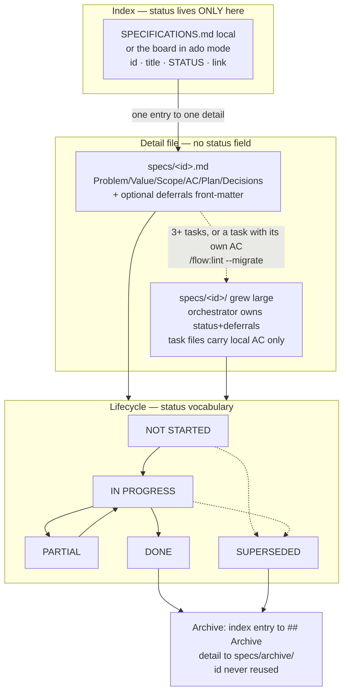
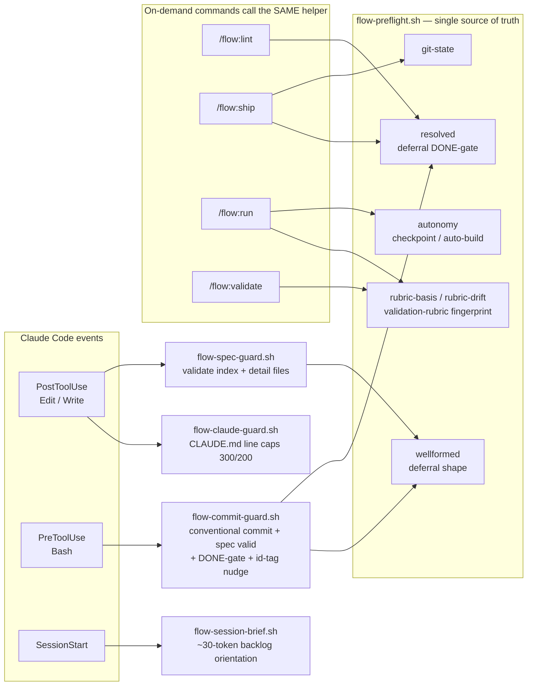
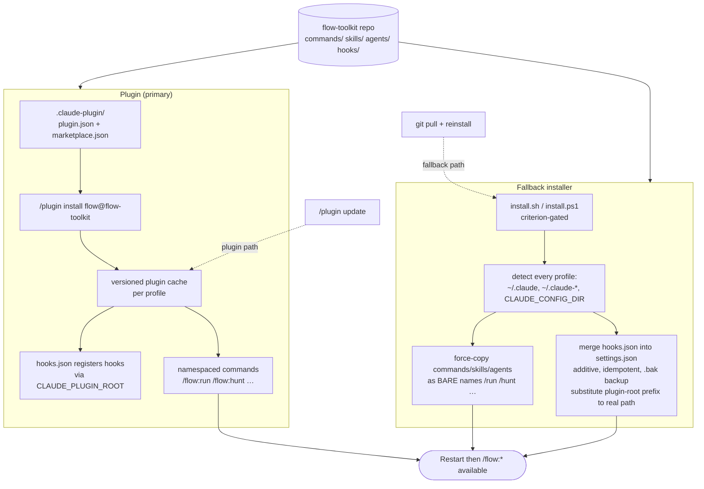

# flow-toolkit — How it works (diagrams)

Five diagrams for the toolkit's core systems. Each renders natively on GitHub and
carries a caption naming the **source files** it depicts — if the source changes and
the diagram doesn't, that's the drift to fix (accuracy is a manual done-check, per
spec 1.12).

Related docs: [**guide.md**](guide.md) is the *how you use it* (every command/skill/agent
with examples); [**architecture.md**](architecture.md) is the *why it's shaped this way*
(the design decision record). This file is the *how it works* — the visual model.

- [1. Development cycle + checkpoint loop](#1-development-cycle--checkpoint-loop)
- [2. Spec model + lifecycle](#2-spec-model--lifecycle)
- [3. Hook / event architecture](#3-hook--event-architecture)
- [4. Install / distribution](#4-install--distribution)
- [5. Agent dispatch — when sub-agents fire](#5-agent-dispatch--when-sub-agents-fire)

---

## 1. Development cycle + checkpoint loop

The spine of `/flow:run <id>`: understand → plan → **checkpoint** → build → done, with
the deferral protocol branching off anywhere scope would narrow, and the DONE-gate at
the end. Autonomy (`checkpoint` vs `auto-build`) changes only the plan-approval pause
and whether the verifier blocks. A spec that declares a `validate:` block also runs the
**validation done-gate** before `DONE` — `flow-ux-validator` per lens, findings triaged.

```mermaid
flowchart TD
    Start(["/flow:run &lt;id&gt;"]) --> U[Understand<br/>read index entry + specs detail file]
    U --> P[Plan<br/>thin slices, files, tests, Value]
    P --> Mode{autonomy?<br/>flow-preflight.sh autonomy}

    Mode -->|checkpoint default| CP{Plan sign-off?}
    CP -->|redirect| P
    CP -->|approve| Write[Write + commit detail file<br/>set IN PROGRESS in index]
    Mode -->|auto-build| Write

    Write --> Build[Build test-first<br/>small commits tagged '[id]']
    Build --> Defer{About to narrow<br/>in-scope work?}
    Defer -->|yes| DP[Deferral protocol:<br/>state why, user decides<br/>build here OR re-home]
    DP --> DEntry[Record deferrals entry<br/>cross-link both specs]
    DEntry --> Build
    Defer -->|no| Verify[flow-verifier checks diff<br/>vs task-local AC]

    Verify --> AB{mode?}
    AB -->|auto-build: blocking| VB{PASS?}
    VB -->|FAIL| Retry[one bounded retry<br/>then escalate to checkpoint]
    Retry --> Build
    VB -->|PASS| Integrate[Integrate diff]
    AB -->|checkpoint: advisory| Integrate

    Integrate --> Gate{deferrals resolved?<br/>flow-preflight.sh resolved}
    Gate -->|open deferral| DP
    Gate -->|clear| Smoke[Restart services<br/>+ smoke-test end-to-end]
    Smoke --> VGate{spec has<br/>validate: block?}
    VGate -->|no| Done[Status to DONE<br/>tick AC, log SHA, archive]
    VGate -->|yes| VUX[flow-ux-validator per lens, serial<br/>N/A passes clean]
    VUX --> Triage{findings triaged?}
    Triage -->|open finding| DP
    Triage -->|clear / none| Done
    Done --> End([hand off; /flow:ship cuts the release])
```

**Sources:** `skills/run/reference/implement.md` (the numbered steps + deferral protocol + validation
done-gate), `skills/run/SKILL.md` (autonomy rules), `agents/flow-ux-validator.md` (the done-gate agent),
`hooks/flow-preflight.sh` (`autonomy`, `resolved`).

---

## 2. Spec model + lifecycle

A spec is an **index entry** (status lives here — single source of truth) plus **one
detail file**. The detail file is flat until it grows, then earns a directory of task
files. When DONE/SUPERSEDED it archives; its id is never reused.



**Sources:** `skills/run/reference/authoring.md` (detail-file + task-file templates,
breakout guideline), `hooks/flow-spec-guard.sh` (index + detail validation, both shapes),
`hooks/flow-preflight.sh` (`resolved` DONE-gate, `wellformed`), `SPECIFICATIONS.md` (the live index).

---

## 3. Hook / event architecture

Four always-on hooks fire on Claude Code events; machine-checkable rules live once in
`flow-preflight.sh`, which the guards **and** the on-demand commands all call — so a rule
can't drift between the seatbelt and the audit. Every hook exits instantly when it
doesn't apply, so unrelated projects pay nothing.



Every guard's first act is "does this apply?" — a non-spec file, a non-commit Bash
command, or a repo with no spec model exits 0 immediately, so unrelated projects pay nothing.

**Sources:** `hooks/hooks.json` (event → script matchers), `hooks/flow-spec-guard.sh`,
`hooks/flow-claude-guard.sh`, `hooks/flow-commit-guard.sh`, `hooks/flow-session-brief.sh`,
`hooks/flow-preflight.sh` (the shared rules). See also `hooks/CLAUDE.md`.

---

## 4. Install / distribution

Primary distribution is the **plugin** — versioned, per-profile, it bundles everything and
registers the hooks via `${CLAUDE_PLUGIN_ROOT}`. The **fallback installer** force-copies the
same content as *bare* names and substitutes that prefix into each profile's `settings.json`.
Both auto-detect every profile; no account name is ever hardcoded.



**Sources:** `.claude-plugin/plugin.json`, `.claude-plugin/marketplace.json`,
`install.sh` / `install.ps1` (profile detection, force-copy, settings merge),
`uninstall.sh` / `uninstall.ps1` (the purge), `hooks/hooks.json` (the registrations substituted).

---

## 5. Agent dispatch — when sub-agents fire

The five skills fan work out to read-only or write sub-agents. This is the "when do agents
get fired off" picture: `run` dispatches on the **build path** (after plan sign-off) — the
implementer/verifier pair per task, plus **`flow-ux-validator` at the done-gate** when the spec
declares a `validate:` block (one per lens, serial); `hunt`/`review`/`pr` dispatch **one agent per
unit** (dimension / lens / dimension) and run them in parallel; `validate` drives the running app
**one lens at a time** (serial — driving a live app is stateful), then the main thread synthesizes. The thin commands (`init`, `lint`,
`ship`) dispatch **nothing** — they run inline.

```mermaid
flowchart TD
    subgraph run["/flow:run &lt;id&gt; — build path, post sign-off"]
        RUN[main thread]
        RUN -->|one per task/layer<br/>worktree-isolated when parallel| IMP["flow-implementer<br/>WRITES to local AC, stops at seam"]
        IMP -->|diff| VER["flow-verifier<br/>READ-ONLY, PASS/FAIL, never fixes"]
        VER -->|auto-build blocking · checkpoint advisory| RUN
        RUN -->|done-gate: spec has validate: block<br/>one per lens, serial| DVUX["flow-ux-validator<br/>READ-ONLY, DRIVES the app, N/A-aware"]
        DVUX -->|findings triaged before DONE| RUN
    end

    subgraph hunt["/flow:hunt — after frame checkpoint"]
        HUNT[main thread] -->|one per research dimension, parallel| RES["flow-researcher xN<br/>READ-ONLY, persona-aware"]
        RES -->|scored candidates| HSYN[dedupe + synthesize]
    end

    subgraph review["/flow:review — per requested lens"]
        REV[main thread] -->|one per lens docs/ux/marketing/product| RVW["flow-reviewer xN<br/>READ-ONLY, one rubric each"]
        RVW -->|findings| RSYN[cross-lens summary]
    end

    subgraph pr["/flow:pr — after diff resolved"]
        PR[main thread] -->|one per dimension spec/quality/tests| PRR["flow-pr-reviewer xN<br/>READ-ONLY, audits the diff"]
        PRR -->|findings| PSYN[verdict + scorecard]
    end

    subgraph validate["/flow:validate — drives the running app"]
        VAL[main thread] -->|one per lens ui/ux, serial| VUX["flow-ux-validator xN<br/>READ-ONLY, DRIVES the app, N/A-aware"]
        VUX -->|findings + rubric status<br/>bootstrap draft / drift / in sync| VSYN[UI/UX assessment]
        VSYN -->|persist confirm-first| RUB[".flow/validate/*.md<br/>project rubric (committed)"]
    end

    subgraph inline["Dispatch nothing — run inline"]
        INIT["/flow:init"]
        LINT["/flow:lint"]
        SHIP["/flow:ship"]
    end
```



**Who writes vs reads:** only `flow-implementer` writes code (worktree-isolated when layers
run in parallel). `flow-verifier`, `flow-researcher`, `flow-reviewer`, `flow-pr-reviewer`,
`flow-ux-validator` are all **read-only** — they report; the main thread decides and applies.
`flow-ux-validator` is the one read-only agent that *drives the running app* rather than reading
source — writing only throwaway screenshots to a scratch dir. The persisted project rubric
(`.flow/validate/*.md`) is likewise agent-proposed but **main-thread-written**, confirm-first —
the agent never touches the project tree (spec 1.16).

**Sources:** `skills/run/reference/implement.md` (implementer/verifier dispatch + gating + validation
done-gate), `skills/hunt/SKILL.md` (Phase 2 fan-out), `skills/review/SKILL.md` (lens dispatch),
`skills/pr/SKILL.md` (Phase 2 fan-out), `skills/validate/SKILL.md` (serial lens dispatch + rubric persist),
`skills/validate/reference/rubric.md` (rubric format + bootstrap/refresh protocol),
`hooks/flow-preflight.sh` (`rubric-basis`/`rubric-drift`), `agents/flow-implementer.md`,
`agents/flow-verifier.md`, `agents/flow-researcher.md`, `agents/flow-reviewer.md`,
`agents/flow-pr-reviewer.md`, `agents/flow-ux-validator.md`.
